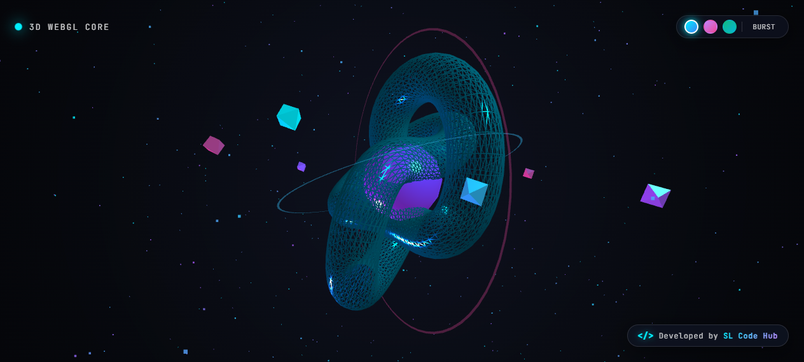

# 🌌 3D WebGL Core — Interactive Three.js Experience

[](https://threejs.org/)
[](https://www.khronos.org/webgl/)
[](https://developer.mozilla.org/en-US/docs/Web/JavaScript)
[](https://developer.mozilla.org/en-US/docs/Web/CSS)
[](LICENSE)

A futuristic, high-performance interactive 3D WebGL experience featuring a holographic wireframe Torus Knot, glowing geometric energy core, orbiting crystalline satellites, and a reactive particle field. Built with **Three.js** and modern Vanilla Web technologies.

---

## 📸 Preview



---

## ✨ Features

- **🌀 Holographic Torus Knot**: Intricate wireframe mesh with high metalness, low roughness, and dynamic ambient reflections.
- **🔮 Pulsing Icosahedron Core**: Dual-layer glowing inner core that counter-rotates smoothly inside the knot.
- **🪐 Orbital Cyber Rings & Satellites**: Multi-axis orbiting rings with floating low-poly octahedral crystals traversing elliptical paths.
- **✨ Physics-Driven Particle Field**: 1,000 dual-tone starfield particles with simulated velocity damping and elastic restitution.
- **💥 Interactive Particle Burst**: Click anywhere on the 3D canvas or tap the `BURST` HUD button to trigger an explosive particle expansion.
- **🎨 Real-Time Theme Switcher**: Instant transition between curated color themes:
  - 💠 **Cyan Horizon** (Default cyberpunk cyan & purple accent)
  - 🌸 **Neon Rose** (Deep purple and hot pink aesthetic)
  - 🌿 **Emerald Matrix** (Vibrant cyber emerald and cyan glow)
- **🕹️ 360° Drag & Touch Rotation**: Freeform rotation on desktop (drag) and mobile devices (touch events) with inertia.
- **👁️ Responsive Mouse Parallax**: Smooth camera easing following cursor movements across the viewport.
- **⚡ Zero Build Dependencies**: Pure HTML5, CSS3, and JavaScript — runs instantly in any modern web browser without bundlers.

---

## 🎮 Interactive Controls

| Input Action | Description |
| :--- | :--- |
| **Mouse Drag / Touch Swipe** | Rotate the 3D scene freely in any direction |
| **Mouse Move** | Subtle parallax tilt following cursor |
| **Canvas Click / Tap** | Trigger explosive particle burst |
| **Theme Buttons (Top Right)** | Switch lighting, knot, and particle color palettes |
| **BURST Button** | Manually disperse the particle cloud |

---

## 📁 Project Structure

```text
├── css/
│   └── style.css          # Futuristic HUD styles, glassmorphism, animations
├── js/
│   └── 3d-scene.js        # Three.js scene, lighting, materials, and physics loop
├── index.html             # Semantic markup, canvas wrapper, HUD controls
├── screenshot.png         # High-resolution application preview
└── README.md              # Project documentation
```

---

---

## 🛠️ Tech Stack & Libraries

- **3D Graphics Engine**: [Three.js r128](https://cdnjs.cloudflare.com/ajax/libs/three.js/r128/three.min.js) via Cloudflare CDN
- **Styling**: Vanilla CSS (CSS Variables, Flexbox, Backdrop Filter Glassmorphism)
- **Font**: JetBrains Mono & Inter via Google Fonts
- **Rendering**: WebGL with Anti-aliasing and Alpha transparency

---

## ⚙️ Customization

You can easily customize properties in [`js/3d-scene.js`](file:///c:/Users/dilsh/Desktop/project/03/js/3d-scene.js):

- **Change Torus Knot Complexity**:
  ```javascript
  // Line 26: TorusKnotGeometry(radius, tube, tubularSegments, radialSegments, p, q)
  const knotGeometry = new THREE.TorusKnotGeometry(1.6, 0.45, 128, 32, 2, 3);
  ```
- **Particle Count**:
  ```javascript
  // Line 99: Change total floating particles
  const particleCount = 1000;
  ```
- **Rotation Speeds**:
  Adjust animation velocities in the `animate()` function.

---

## 👨‍💻 Developer & Credits

Crafted with ❤️ by **SL Code Hub**

- **Project**: 3D WebGL Core
- **Author**: SL Code Hub
